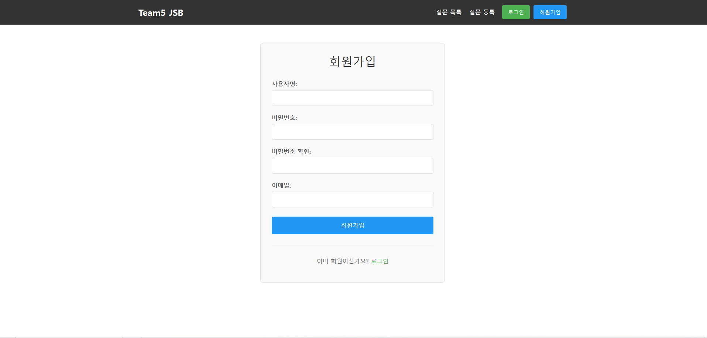
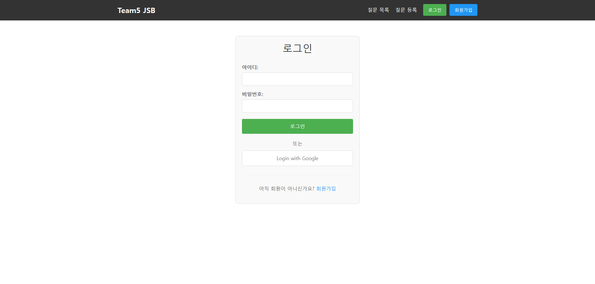
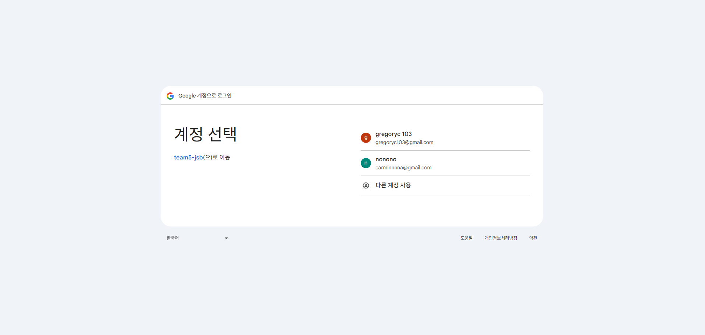
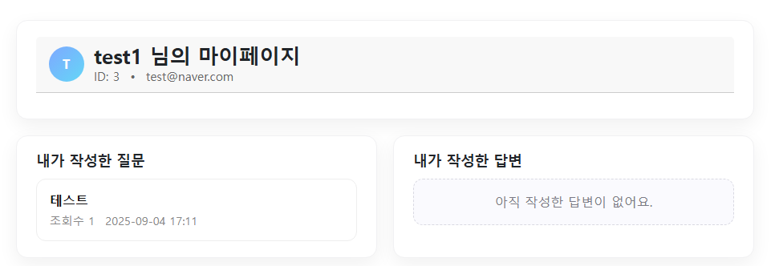
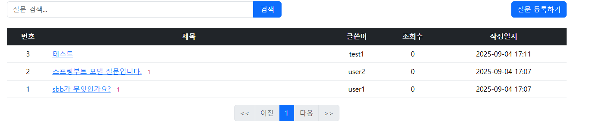
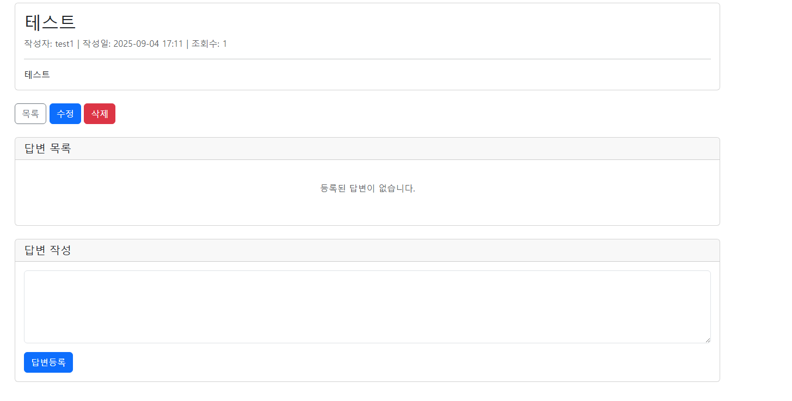
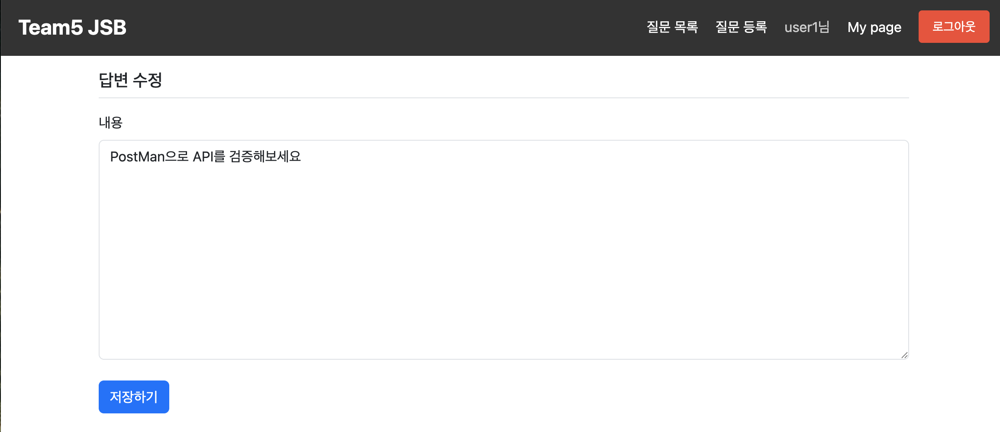
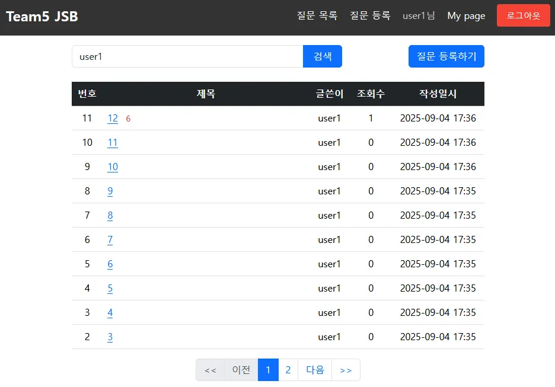
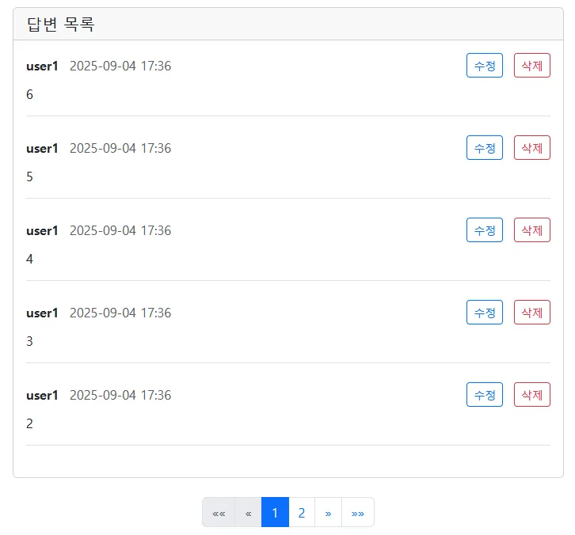

## 📌 1. 과제 개요

- 스프링부트를 활용하여 웹 애플리케이션을 만들고, 데이터베이스와 연동하여 **질문/답변 게시판(Q&A)** 기능을 완성하는 것이 목표입니다.
- 단순히 코드만 구현하는 것이 아니라, **MVC 구조의 이해**, **데이터베이스 활용**, **회원 인증/인가** 등 **웹 서비스 전반에 대한 기본기**를 학습하는 데 초점을 둡니다. 🚀
- 과정에서 배운 내용을 최대한 적용해보세요.

---

## 🛠️ 2. 구현 범위

### ⚙️ 기본 프로젝트 세팅

- Spring Initializr를 활용해 프로젝트 생성
- 필수 Dependencies:
  - 🌐 Spring Web
  - 🎨 Thymeleaf
  - 🗄️ Spring Data JPA
  - 💾 H2 Database
  - 🔄 Spring Boot DevTools
  - 🌶️Lombok

---

## 📝 3. 기본 기능

### 📋 게시판 기능 (Q&A)

아래 기능은 필수로 구현 하여야 합니다.

- 질문
  - 질문 목록 보기
  - 질문 등록 ✍️
  - 질문 상세 보기 🔎
  - 질문 수정 ✏️
  - 질문 삭제 🗑️
- 답변
  - 답변 등록
  - 답변 수정
  - 답변 삭제
- 검색 기능 🔍 (제목/내용/작성자 기준 검색)

### 👤 회원 기능

- 회원가입 ✨
- 로그인 & 로그아웃 🔐 (Spring Security 활용)

---

## 🌟 4. 추가 기능 (심화 · 선택)

- 📄 질문, 답변 페이징 기능 구현
- ⏱️ 생성일시 내림차순으로 질문, 답변 정렬 기능 구현
- 👀 조회 수 표시 기능 구현
- 🖼️ 마이페이지 구현
- 🌐 소셜 미디어 로그인 (구글)
- 📝 마크다운 에디터 적용하기 (글 작성 시 적용)

---

## 📤 5. 제출 방법

- 팀장 GitHub Repository에 코드 업로드
- `README.md` 작성 (다음 항목 포함 필수)
  - 🔧 **구현한 기능 목록과 담당**
  - **🏌트러블슈팅**
  - 💡 **어려웠던 점 & 느낀 점**  (학습 과정에서의 고민과 배운 점을 중심으로 작성)

---

## 🌱 공통 엔티티 (BaseEntity)

프로젝트 전반에서 공통으로 사용하는 엔티티입니다.  
모든 엔티티에 **생성/수정 시간**을 자동으로 기록하기 위해 사용합니다.

| 🏷️ 필드명 | 🗂️ 타입 | 📖 설명 | ⚙️ 비고 |
| --- | --- | --- | --- |
| `id` | Long | 기본 키 | 자동 증가 (`IDENTITY`) |
| `createdDate` | LocalDateTime | 생성일 | `@CreatedDate`, 수정 불가 |
| `modifiedDate` | LocalDateTime | 수정일 | `@LastModifiedDate` |


---

# 📌 Q&A 게시판 - 회원 기능(담당 - 임창기)

## 🔧 환경 설정

### 1. Google OAuth2 설정 (필수)

Application 실행 시 Google 소셜 로그인 기능을 사용하기 위해 다음 설정이 필수

#### 1.1 Google Cloud SDK 설치

- **winget**, **choco**, 또는 **설치 프로그램** 사용

#### 1.2 설치 후 Git Bash에서 다음 명령어 실행

```bash
# Google Cloud SDK 버전 확인
gcloud --version

# Google 계정 로그인
gcloud auth login

# 애플리케이션 기본 자격증명 설정
gcloud auth application-default login

# 프로젝트 설정
gcloud config set project complete-welder-330305
```

> **참고**: `application-default login`은 애플리케이션이 Secret Manager를 읽을 자격증명(ADC)을 저장
>
> **프로젝트 관리자 작업**: 팀원 구글 계정에 프로젝트 IAM 역할 부여 필요
> - `roles/secretmanager.secretAccessor`

#### 1.3 Secret Manager 값 확인

```bash
# OAuth Client ID 확인
gcloud secrets versions access latest --secret=google-oauth-client-id --project=complete-welder-330305

# OAuth Client Secret 확인
gcloud secrets versions access latest --secret=google-oauth-client-secret --project=complete-welder-330305
```
> ✅ 값이 출력되면 접근 권한이 정상적으로 설정 완료

### 2) application.yml 설정

`src/main/resources/application.yml`에 다음 설정이 필요
```yaml
spring:
  config:
    import: "optional:sm://"

  cloud:
    gcp:
      secretmanager:
        project-id: complete-welder-330305

  security:
    oauth2:
      client:
        registration:
          google:
            client-id: '${sm://google-oauth-client-id}'
            client-secret: '${sm://google-oauth-client-secret}'
            scope: openid, email, profile
            redirect-uri: "{baseUrl}/login/oauth2/code/google"
```

---

## ✅ 기능

- [x] 회원가입 ✍️
- [x] 로그인/로그아웃 🔐
- [x] Google 소셜 로그인 🌐
- [x] 보안 설정 🛡️

---

## ✅ 화면

> 회원가입 페이지

> 로그인 페이지

> Google 소셜 로그인

---

## ✅ Entity 설계

## User

| 필드명 | 타입 | 설명 | 비고 |
| --- | --- | --- | --- |
| id | Long | 기본 키 | BaseEntity 상속 |
| username | String | 사용자명 | `@Column(unique = true, length = 50)` |
| password | String | 비밀번호 | BCrypt 암호화 |
| email | String | 이메일 | `@Column(unique = true, length = 100)` |
| provider | AuthProvider | 로그인 방식 | `@Enumerated(EnumType.STRING)` |
| providerId | String | 소셜 로그인 ID | `@Column(length = 100)` |
| createdDate | LocalDateTime | 생성일 | BaseEntity |
| modifiedDate | LocalDateTime | 수정일 | BaseEntity |

## AuthProvider (Enum)

| 값 | 설명 |
| --- | --- |
| LOCAL | 일반 회원가입 |
| GOOGLE | Google OAuth |
| KAKAO | Kakao OAuth (추후 구현) |
| NAVER | Naver OAuth (추후 구현) |

---

### 연관 관계

- `questions : List<Question>` → **OneToMany** (작성한 질문 목록, CascadeType.PERSIST/REMOVE)
- `answers : List<Answer>` → **OneToMany** (작성한 답변 목록, CascadeType.PERSIST/REMOVE)

---

## 📌 Thymeleaf Template

- 회원가입: `user/signup`
- 로그인: `user/login`
- 마이페이지: `mypage`
- 에러 처리: `common/fragment/errors`
- 헤더: `common/fragment/header`
- 레이아웃: `templates/layout`

## API 명세서

| 메서드 | 경로 | 설명 | 요청값 | 모델 속성 | 반환 |
| --- | --- | --- | --- | --- | --- |
| GET | `/user/signup` | 회원가입 폼 | - | `signupRequest` | `user/signup` |
| POST | `/user/signup` | 회원가입 처리 | `SignupRequest` (검증 포함) | - | 성공: `redirect:/user/login`<br>실패: `user/signup` |
| GET | `/user/login` | 로그인 폼 | - | `loginRequest` | `user/login` |
| POST | `/user/login-validate` | 로그인 처리 | `LoginRequest` (검증 포함) | - | 성공: `redirect:/`<br>실패: `redirect:/user/login?error` |
| GET | `/user/logout` | 로그아웃 | - | - | `redirect:/user/login` |
| GET | `/oauth2/authorization/google` | Google 로그인 | - | - | Google 인증 페이지로 리다이렉트 |
| GET | `/login/oauth2/code/google` | Google 콜백 | 인증 코드 | - | 성공: `redirect:/`<br>실패: 에러 페이지 |
| GET | `/mypage` | 마이페이지 | `page`(int, 기본 0), `answerPage`(int, 기본 0) | `user`(UserProfileDto), `questions`(Page<Question>), `answers`(Page<Answer>) | `mypage` |

---

# 🛠️ Trouble Shooting

## 1. 문제 상황 - OAuth2 vs OIDC 구분

- 처음에는 Google 로그인을 **OAuth2 방식**으로 구현하려 했음.
- `CustomOAuth2UserService`를 만들어서 `userInfoEndpoint`에 설정했으나 전혀 호출되지 않음.
- 디버그 로그가 하나도 출력되지 않아서 설정 문제인지 의심했음.

## 2. 시도한 해결 과정

1. SecurityConfig 설정을 여러 번 확인하고 Bean 등록 상태도 점검.
2. 로그를 자세히 분석한 결과 `OIDC_USER` 권한과 Google scope들이 출력되는 것을 발견.
3. Google이 **OpenID Connect(OIDC)** 를 지원한다는 것을 알게 됨.
4. `CustomOidcUserService`로 전환하고 `.oidcUserService()` 설정으로 변경.

## 3. 배운 점

- **Google은 OIDC를 사용**하므로 `OidcUserService` 확장 필요.
- **Kakao, Naver는 일반 OAuth2**이므로 `OAuth2UserService` 사용.
- Spring Security가 자동으로 OIDC와 OAuth2를 구분해서 처리한다는 것을 배웠음.

---

## 4. 문제 상황 - Principal 타입 불일치

- `@AuthenticationPrincipal CustomUserDetails`를 사용했는데 Google 로그인 사용자는 `null`로 처리됨.
- 마이페이지, 질문 등록, 답변 등록에서 모두 NullPointerException 발생.
- 일반 로그인과 소셜 로그인의 Principal 타입이 달라서 생긴 문제.

## 5. 시도한 해결 과정

1. 처음에는 Google 로그인만 CustomOidcUser로 변경하려 했으나 기존 코드 영향도가 큼.
2. `Authentication` 객체를 직접 사용하는 방식으로 변경.
3. `getCurrentUser()` 헬퍼 메서드를 만들어서 타입별로 안전하게 User 정보 추출.
4. 모든 컨트롤러에서 동일한 방식으로 적용.

## 6. 배운 점

- Spring Security에서 **인증 방식별로 Principal 타입이 다르다**는 것을 배움.
- `instanceof`를 활용한 **타입 안전한 처리 방법** 습득.
- 하나의 애플리케이션에서 **여러 인증 방식을 동시 지원**하는 방법을 익힘.

---

## 7. 문제 상황 - 순환 의존성

- Bean 생성 과정에서 `BeanCurrentlyInCreationException` 발생.
- SecurityConfig ↔ UserService ↔ PasswordEncoder 간 순환 참조 문제.
- 애플리케이션이 시작되지 않음.

## 8. 시도한 해결 과정

1. 의존성 관계를 분석해서 순환 고리 파악.
2. `@Lazy` 어노테이션을 적절한 위치에 적용.
3. UserService와 SecurityConfig 모두에 `@Lazy` 설정.

## 9. 배운 점

- Spring에서 **순환 의존성 문제의 원인과 해결 방법** 이해.
- `@Lazy`를 통한 **지연 로딩으로 순환 고리를 끊는 방법** 학습.
- **복잡한 보안 설정에서 자주 발생하는 문제**라는 것을 인식.

---

# 📑 마이페이지 기능 (담당 - 노현정)

## 🔎 구현 개요

- 로그인한 사용자가 자신의 활동 내역을 확인할 수 있는 **마이페이지** 화면을 구현하였습니다.
- 단순 조회뿐만 아니라, **회원 정보 + 내가 작성한 질문 목록 + 내가 작성한 답변 목록**을 페이징 처리하여 제공합니다.
- Spring Security의 인증 객체(`@AuthenticationPrincipal`)를 활용하여 **현재 로그인한 사용자**의 데이터만 불러올 수 있도록 구성했습니다.

---

## 🛠️ 주요 기능

1. **회원 정보 표시**
- 사용자 이름, 이메일 등의 기본 프로필 정보 출력
- 사용자 이름의 첫 글자를 활용한 기본 아바타(Avatar) 표시
2. **내가 작성한 질문**
- 로그인 사용자가 작성한 질문 목록을 최신순으로 출력
- 페이징 처리(이전/다음 버튼) 및 조회수 표시 기능 제공
3. **내가 작성한 답변**
- 로그인 사용자가 작성한 답변 목록을 최신순으로 출력
- 답변이 작성된 질문 제목과 함께 링크로 연결
- 페이징 처리 및 작성일시 출력

---

## ✅화면
>

---

## 💡 트러블슈팅

- **LazyInitializationException** 발생
  → `AnswerRepository`에서 `@EntityGraph(attributePaths={"question"})`를 사용하여 답변과 함께 질문 엔티티를 한 번에 로딩하도록 수정
- **템플릿 파싱 오류** (`#strings.abbreviate` 사용 불가)
  → `#strings.substring`과 삼항 연산자를 사용하여 문자열을 안전하게 잘라내도록 수정
- **author 값 누락**으로 마이페이지에 내 답변이 표시되지 않던 문제
  → 답변 생성 시 반드시 `answer.setAuthor(user)`를 호출하여 작성자를 저장하도록 수정

---

## 🎨 화면 구성

- 모던한 카드 스타일 UI 적용
- 질문/답변을 2열 그리드로 배치하여 가독성 향상
- 비어 있는 경우 `“아직 작성한 질문/답변이 없습니다”` 메시지 출력
---

# 📌 Q&A 게시판 - Question 기능(담당 - 윤주찬)

## ✅ 기능

- [x]  질문 목록 보기
- [x]  질문 등록 ✍️
- [x]  질문 상세 보기 🔎
  - 제목, 내용, 작성자(합칠 때 생길 예정), 조회수(세웅님이 구현), 작성/수정 시간 표시
- [x]  질문 수정 ✏️
- [x]  질문 삭제 🗑️

---

## ✅ 화면

>


---

## ✅ Entity 설계

## Question

| 필드명 | 타입 | 설명 | 비고 |
| --- | --- | --- | --- |
| id | Long | 기본 키 | BaseEntity 상속 |
| subject | String | 질문 제목 | `@Column(length = 200)` |
| content | String | 질문 내용 | `@Column(columnDefinition = "TEXT")` |
| viewCount | Integer | 조회수 | 기본값 0 |
| createdDate | LocalDateTime | 생성일 | BaseEntity |
| modifiedDate | LocalDateTime | 수정일 | BaseEntity |

---

### 연관 관계

- `author : User` → **ManyToOne** (질문 작성자)
- `answerList : List<Answer>` → **OneToMany** (질문에 달린 답변, CascadeType.PERSIST/REMOVE)

---

## 📌 Thymeleaf Template

- 질문 목록: `question_list`
- 질문 작성 폼: `question_form`
- 질문 상세: `question_detail`
- 질문 수정 폼: `question_modify_form`

## API 명세서

| 메서드 | 경로 | 설명 | 요청값 | 모델 속성 | 반환 |
| --- | --- | --- | --- | --- | --- |
| GET | `/question/list` | 질문 목록 조회 | `page`(int, 기본 0), `kw`(String, 기본 "") | `paging`(Page<QuestionResponseDTO>), `kw` | `question_list` |
| GET | `/question/create` | 질문 작성 폼 | - | `questionCreateDTO` | `question_form` |
| POST | `/question/create` | 질문 작성 처리 | `QuestionCreateDTO` (검증 포함) | - | 성공: `redirect:/question/list`<br>실패: `question_form` |
| GET | `/question/detail/{id}` | 질문 상세 조회 + 답변 페이징 | `page`(int, 기본 0), `answerPage`(int, 기본 0) | `question`(QuestionResponseDTO), `answerPaging`(Page<Answer>), `answerCreateDto` | `question_detail` |
| GET | `/question/modify/{id}` | 질문 수정 폼 | `id` | `questionUpdateDto`, `questionId` | `question_modify_form` |
| POST | `/question/modify/{id}` | 질문 수정 처리 | `QuestionUpdateDto` (검증 포함) | - | 성공: `redirect:/question/detail/{id}`<br>실패: `question_modify_form` |
| GET | `/question/delete/{id}` | 질문 삭제 | `id` | - | `redirect:/question/list` |

---

# 🛠️ Trouble Shooting

## 1. 문제 상황

- REST API 방식에 익숙해져서 **수정(put), 삭제(delete)** 요청을 그대로 구현하려 했음.
- 그러나 **Thymeleaf + HTML form** 환경에서는 `GET` / `POST` 방식만 지원한다는 제약을 몰랐음.
- 그 결과, 템플릿에서 `PUT`, `PATCH`, `DELETE` 요청을 직접 처리하려고 시도하다가 에러 및 동작 불가 문제 발생.

## 2. 시도한 해결 과정

1. 처음에는 `PUT`, `DELETE` 그대로 사용하려고 했으나 브라우저 form 한계로 불가능.
2. 강사님께 질문하고 자료를 찾아보며, **비동기 요청(AJAX, fetch, axios 등)** 을 사용하면 `DELETE`, `PUT`, `PATCH`도 가능하다는 사실 확인.
3. 현재 프로젝트에서는 비동기 방식 도입 전이므로, **템플릿 기반 처리 방식으로 임시 해결**
  - 수정(update) → 등록(create)과 동일하게 `POST` 사용.
  - 삭제(delete) → 간단하게 `GET` 매핑으로 처리.

## 3. 배운 점

- HTML form은 오직 `GET`, `POST`만 지원한다….
- `PUT`, `PATCH`, `DELETE`는 **비동기 요청(AJAX/fetch)** 또는 **Spring HiddenHttpMethodFilter** 등을 활용해야 한다.
- MVC 기반 Thymeleaf 프로젝트에서는 우선 `GET/POST`로 구현하고, 이후 RESTful 구조로 확장할 때는 자바스크립트 비동기 요청을 사용해야 한다라는 걸 알게되었다.

---

# 📌 Q&A 게시판 - 답변 기능(담당 - 주권영)

##  ✅ 기능

---

- 답변 목록 보기 (작성자, 생성일, 수정일 포함)
- 답변 등록
- 답변 수정
- 답변 삭제

## 🏞️ 구현 화면

> 답변 등록 화면


> 답변 수정 화면


## ✅ Entity 설계

Answer
---
| 필드명 | 타입 | 설명 | 비고 |
| --- | --- | --- | --- |
| id | Long | 기본 키 | BaseEntity |
| content | String | 답변 내용 | `@Column(columnDefinition = "TEXT")` |
| createdDate | LocalDateTime | 생성일 | BaseEntity |
| modifiedDate | LocalDateTime | 수정일 | BaseEntity |

연관 관계

- `Question : Answer`  → `1:N`
- `user : Answer` → `1:N`

## 📌 Thymeleaf Template

---

- 질문 상세 내의 답변목록 : `question_detail`
- 답변 수정 폼 : `answer_form`

API 명세서

---

| **메서드** | **경로** | **설명** | **요청값** | **모델 속성** | **반환** |
| --- | --- | --- | --- | --- | --- |
| POST | `/answer/create/{id}` | 답변 등록 | `questionId`
`AnswerCreateDto` | `AnswerCreateDto` | `question_list` |
| GET | `/answer/delete/{id}` | 답변 삭제 | `id` | - | `redirect:/question/detail/{id}` |
| GET | `/answer/modify/{id}` | 답변 수정 폼 | `id` | `AnswerUpdateDto` 
`id` | `answer_form` |
| POST | `/answer/modify/{id}` | 답변 수정 | `id` | - | `redirect:/question/detail/{id}` |

## 🛠 Trouble Shooting

---

1. 답변 등록 필터링
- 문제 :  `form_errors`  를 활용하여 답변 입력 폼을 필터링 하였지만, 병합하는 과정에서 해당 파일이 올바르게 호출되지 않음
- 해결 : 질문 등록

---

# **🔥 추가 기능(담당 - 박세웅)**

- 질문 목록 검색
  - 제목, 내용, 작성자 필드에서 키워드를 포함하는 질문을 검색
- 질문 목록 페이징
  - `createdDate` 내림차순 으로 정렬
  - 페이지 당 10개의 질문 제한
  - 페이지 번호, 이전, 이후, 맨 앞, 맨 뒤 이동 기능
- 답변 목록 페이징
  - `createdDate` 내림차순 으로 정렬
  - 페이지 당 5개의 답변 제한
  - 페이지 번호, 이전, 이후, 맨 앞, 맨 뒤 이동 기능
- 질문 상세 조회 시 조회수 증가

---

## **🔎 기능 구현 화면**

>


---

## **✨ 기능 구현**

### **📄 1. 검색 기능**

### **`QuestionController.java`**

- `@GetMapping("/list")` 메서드에서 `kw`(키워드) 파라미터를 받아 서비스 계층으로 전달합니다.

```java
@GetMapping("/list")
public String list(Model model,
                   @RequestParam(value = "page", defaultValue = "0") int page,
                   @RequestParam(value = "kw", defaultValue = "") String kw) {
    Page<QuestionResponseDTO> paging = this.questionService.getList(page, kw);
    model.addAttribute("paging", paging);
    model.addAttribute("kw", kw);
    return "question_list";
}
```
---

### **`QuestionRepository.java`**

- JPQL `@Query`를 사용하여 `subject`(제목), `content`(내용), `author.username`(작성자) 필드에서 키워드를 포함하는 질문을 검색합니다.

```java
@Query("""
    select q from Question q
    where q.subject like %:kw%
    or q.content like %:kw%
    or q.author.username like %:kw%
        order by q.createdDate desc
""")
Page<Question> findAllByKeywordOrderByCreatedDateDesc(@Param("kw") String kw, Pageable pageable);
```
---

### **📄 2. 페이징 기능**

**질문 목록과 답변 목록에 페이징 기능을 적용했습니다.**

- `PageRequest.of()`를 사용하여 페이지 번호, 페이지 당 게시물 수, 정렬 기준(`createdDate` 내림차순)을 담은 `Pageable` 객체를 생성합니다.

```java
@Transactional(readOnly = true)
public Page<QuestionResponseDTO> getList(int page, String kw) {
    Pageable pageable = PageRequest.of(page, PAGE_SIZE, Sort.by(Sort.Direction.DESC, "createdDate"));
    // ...
    Page<Question> pageResult = questionRepository.findAll(pageable);
    // ...
    return pageResult.map(QuestionResponseDTO::fromEntity);
}

```
---

### **`question_list.html` (질문 페이징)**

- Thymeleaf를 사용하여 컨트롤러에서 전달받은 `Page` 객체(`paging`)의 정보를 기반으로 페이지네이션 UI를 동적으로 생성합니다.

---

### **`AnswerService.java` (답변 페이징)**

- `getAnswers` 메서드는 `Question` 엔티티와 `page` 번호를 받아 해당 질문에 달린 답변들을 페이징 처리하여 반환합니다. 답변은 최신순으로 정렬됩니다.

```java
@Transactional(readOnly = true)
public Page<Answer> getAnswers(Question question, int page) {
    // 답변은 항상 최신순으로 정렬 (createdDate 내림차순)
    Pageable pageable = PageRequest.of(page, PAGE_SIZE, Sort.by(Sort.Direction.DESC, "createdDate"));
    return answerRepository.findByQuestionOrderByCreatedDateDesc(question, pageable);
}

```

### **`question_detail.html` (답변 페이징)**

- 답변 목록 아래에 페이지네이션 UI를 구현합니다. 질문 목록 페이징과 유사한 구조를 가집니다.
 ---

### **📄 3. 조회수 기능**

### **`Question.java`**

- `Question` 엔티티에 `viewCount` 필드를 추가하고, 조회수를 1 증가시키는 `increaseViewCount()` 메서드를 정의했습니다.

```java
@Entity
public class Question extends BaseEntity {
    // ...
    @Column(columnDefinition = "integer default 0")
    private Integer viewCount = 0;
    // ...
    public void increaseViewCount() {
        this.viewCount = (this.viewCount == null) ? 1 : this.viewCount + 1;
    }
}

```
---

### **`QuestionController.java`**

- `detail` 메서드에서 질문 상세 정보를 조회할 때 `questionService.getQuestion()`을 호출하여 조회수를 증가시킵니다.

```java
@GetMapping("/detail/{id}")
public String detail(@PathVariable("id") Long id, Model model, /*...*/) {
    // ...
    QuestionResponseDTO questionDto = this.questionService.getQuestion(id, true); // increaseView를 true로 전달
    // ...
    model.addAttribute("question", questionDto);
    return "question_detail";
}

```
---

## **🛠️ Trouble Shooting**

1. DTO 도입으로 인한 페이징 오류: 초기에 개발 상태에서는 페이징과 정렬 구현을 DTO를 고려하지 않고 엔티티에서 직접 참조 하여 문제가 발생함
- **페이징 타입**: `Page<Question>` → `Page<QuestionResponseDTO>`로 변경.
- **템플릿 바인딩**: 엔티티 경로(`author.username`) → DTO 필드(`authorUsername`)로 변경하여 N+1/지연로딩 이슈 방지 및 안정성 향상.
1. 조회수 기능이 답변을 입력하면 올라가는 오류:
- **`RedirectAttributes`**의 **`addFlashAttribute`**를 사용하여, 답변 등록과 같은 특정 작업 후 리다이렉트될 때 일회성 데이터를 전달했습니다.
- 이를 통해 질문 상세 페이지 컨트롤러는 "방금 답변이 등록되었는지" 여부를 판단하여 불필요한 조회수 중복 증가를 방지할 수 있습니다.

---

## **💡 배운 점**

1. **Spring Data JPA의 강력함**: `Pageable`과 `@Query` 어노테이션만으로도 복잡한 검색 및 페이징 로직을 간결하게 구현할 수 있었습니다.
2. **Thymeleaf의 동적 렌더링 활용**: Thymeleaf의 조건부 렌더링(`th:if`)과 반복문(`th:each`)을 활용하여 서버에서 전달된 `Page` 객체의 상태에 따라 페이지네이션 UI를 동적으로 생성하는 방법을 익혔습니다. 이를 통해 서버와 템플릿 간의 데이터 연동을 효율적으로 처리할 수 있었습니다.

---

